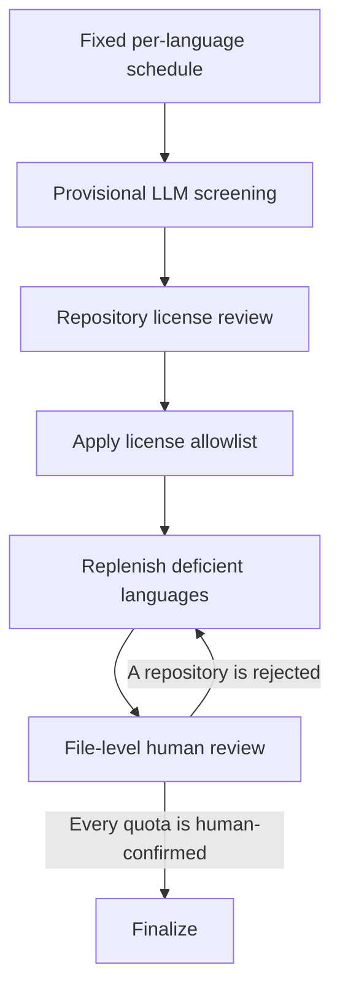

# swe-conform

This repository builds a reusable candidate set for evaluating coding agents on
project guidelines and refactoring tasks.

## Repository filter

The filter processes repositories in this order:

1. Fetch every Git object reachable from each input `lastCommitSHA` into the
   persistent HDD cache without shallow or partial-clone filters.
2. Materialize that exact revision from the HDD cache in a disposable SSD
   workspace without Git metadata or network access.
3. Run Codex CLI in a restricted container to search the complete snapshot for
   natural-language statements that directly constrain the content, structure,
   or behavior of source code or test code.
4. Verify every `pass` quote at its reported path and preserve every verified
   guideline file as an output artifact.

License metadata from the candidate CSV does not affect automated guideline
classification. Target-based collection applies a human-authored license
policy after provisional classification and before file-level human review.

The container receives only a read-only snapshot, a writable output directory,
and a temporary Codex home containing selected authentication runtime files.
Bubblewrap hides that temporary Codex home from model-generated tools. The real
user home and Docker socket are not mounted. User configuration, exec-policy
rules, persistence, browser, plugins, skill search, multi-agent features, and
other optional harness components are disabled. Repository contents are treated
as untrusted evidence.

See [docs/filtering_method.md](docs/filtering_method.md) for the complete
classification contract and limitations.

## Setup

```bash
uv sync --frozen
```

The filter uses the signed-in Codex CLI and does not require `OPENAI_API_KEY`.
Build the pinned exploration image once on each execution host:

```bash
docker build \
  --file docker/codex.Dockerfile \
  --tag swe-conform-codex:0.146.0 \
  docker

uv run --frozen python src/main.py preflight
```

Preflight must succeed on every execution host before a filter run. It verifies
the system bubblewrap installation, sandbox launch, repository read access,
repository write denial, Codex credential denial, and tool network denial. A
failure exits before any repository is submitted to the model.

Validate all tracked input files without using either API:

```bash
uv run --frozen python src/main.py validate
```

Run a small pilot:

```bash
uv run --frozen python src/main.py filter \
  --limit 20 \
  --output-dir output/pilot
```

This direct pilot mode downloads each source snapshot immediately and remains
available for quick local checks. It still uses the container by default. Use
`--codex-runtime host` only for local debugging. The research run separates network
acquisition from Codex exploration. First fetch the pinned repositories to the
HDD:

```bash
uv run --frozen python src/main.py fetch \
  --cache-root /mnt/hdd/swe-conform-repositories
```

Then run the complete dataset with temporary workspaces on the SSD:

```bash
uv run --frozen python src/main.py filter \
  --cache-root /mnt/hdd/swe-conform-repositories \
  --workspace-root /mnt/ssd/swe-conform-workspaces \
  --output-dir output/repository-selection
```

The HDD and SSD mount points must be available, and the SSD workspace root must
exist before the filter starts.

The same two commands accept `--limit 20` for a cache-backed pilot. Re-running
`fetch` skips snapshot refs already present in the cache and retries missing or
failed repositories. Per-repository acquisition results are written to
`output/repository-cache/fetch_results.jsonl` by default.

## HDD-backed Markdown classification

The production per-file pipeline first applies the mechanical Markdown filename
and content filters directly to the pinned bare repositories:

```bash
uv run --frozen python src/main.py audit-markdown-filenames \
  --input-dir docs/repository-candidates \
  --output-dir output/markdown-candidates \
  --cache-root /mnt/hdd/swe-conform-repositories \
  --cache-only \
  --skip-incomplete-repositories \
  --exclude-repository revanced/revanced-patches \
  --workers 16
```

It then reads each selected blob from the same pinned snapshot and submits one
file per model request:

```bash
uv run --frozen --env-file .env python src/main.py classify-markdown run-cache \
  --candidate-csv output/markdown-candidates/markdown_filename_files.csv \
  --repository-summary-csv output/markdown-candidates/repository_filename_summary.csv \
  --output-dir output/markdown-classification \
  --cache-root /mnt/hdd/swe-conform-repositories \
  --skip-incomplete-repositories \
  --exclude-repository revanced/revanced-patches \
  --provider bedrock \
  --bedrock-region us-east-1 \
  --workers 16
```

Both stages verify every Git object reachable from `lastCommitSHA` before
processing a repository. They never fall back to GitHub. Incomplete and
explicitly excluded repositories are recorded in `skipped_repositories.csv`.
Classification records Markdown files larger than `--max-input-bytes` as
`input_too_large` and leaves their repository unresolved unless another file is
positive; it neither truncates nor submits those files. Reusing an output
directory is allowed only when the candidate inputs, prompt, schema, model
settings, size limit, and cache-safety options are unchanged.

## Target-based stratified collection

Use the integrated collection command to continue the prior 50- and
20-repository stratified samples until the benchmark contains an equal number
of positive repositories from Java, JavaScript, Python, and TypeScript. The
command computes the human-confirmed baseline count in each language from the
two file-level checklists, excludes every repository in both prior samples, and
then follows the existing deterministic random order within each language from
an explicitly selected repository source. It generates the complete fixed
schedule before either classification or license review.

Collection advances through these stages in one output directory:

1. Classify repositories provisionally, without a license allowlist, until each
   language reaches its provisional quota.
2. Review the reported license names of the provisionally selected
   repositories and author an allowlist.
3. Apply that allowlist by resuming the same collection. Ineligible positives
   stop counting toward their language quota, and replacements are classified
   in the original fixed order.
4. Review only the eligible positive files. Resume after each review round to
   replace rejected repositories within the deficient language.
5. Finalize only after every language quota is human-confirmed.

License review is therefore independent of the classifier, while license and
scope decisions still determine final benchmark membership. Provisional
classification attempts remain in the collection for audit even when their
repositories later become ineligible.

See
[ADR-0023](docs/adr/0023_classify_repositories_before_license_and_scope_review.md)
for the workflow rationale and rejected orderings.

The collection directory is durable workflow state, not just a destination for
reports. Start with a new directory, then reuse that exact directory for every
resume, license-policy application, review round, and finalization input:



The following examples use one set of paths throughout the workflow:

```bash
readonly HELDOUT_ROOT="experiments/heldout-guideline-recall-20260807"
readonly CONTROL_ROOT="experiments/guideline-prompt-control-20260812"
readonly COLLECTION_ROOT="output/guideline-collection"
readonly LICENSE_ROOT="${COLLECTION_ROOT}/license-review"
readonly FINAL_ROOT="${COLLECTION_ROOT}/final"
```

Do not reuse an output directory from another configuration. The collection
configuration fixes the candidate inputs, random seed, classification
contract, model settings, and license-policy state. A compatible rerun resumes
its append-only checkpoints; an incompatible rerun fails instead of mixing
experiments.

### 1. Provisional repository classification

The first run intentionally omits `--license-allowlist-csv`,
`--human-checklist`, and `--review-output-checklist`. It determines which
repositories contain at least one candidate guideline file before license or
file-level human review:

```bash
uv run --frozen --env-file .env python src/main.py collect-guideline-repositories \
  --input-dir docs/repository-candidates \
  --output-dir "$COLLECTION_ROOT" \
  --repository-source github \
  --baseline-checklist "$HELDOUT_ROOT/manual-pass-review/checklist_full.csv" \
  --baseline-checklist "$CONTROL_ROOT/manual-review/checklist2_full.csv" \
  --exclude-csv "$HELDOUT_ROOT/input/candidates.csv" \
  --exclude-csv "$CONTROL_ROOT/input/candidates.csv" \
  --target-total-repositories 120 \
  --max-screened-repositories 300 \
  --sample-seed 20260807 \
  --repository-workers 4 \
  --file-workers 16 \
  --max-repository-attempts 3 \
  --max-model-attempts 3 \
  --max-retrieval-attempts 2 \
  --blob-batch-size 64 \
  --max-input-bytes 200000 \
  --provider bedrock \
  --bedrock-region us-east-1 \
  --model gpt-5.6-luna \
  --reasoning-effort max \
  --max-output-tokens 32000
```

For a cache-backed run, use the same command and replace the repository-source
arguments with:

```bash
--repository-source cache \
--cache-root /hdd/shigyo/swe-conform-repositories
```

For each scheduled repository, the command performs these operations in order:

1. Resolve the immutable repository snapshot at the recorded `lastCommitSHA`.
2. Enumerate every Markdown file in the snapshot.
3. Apply the filename-term filter, then the content-term filter.
4. Group byte-identical candidate contents by SHA-256 within the repository and
   retain one canonical file for LLM classification.
5. Classify every remaining candidate file independently.
6. Mark the repository `pass` when at least one file is `pass` or semantic
   `review`; mark it `not_found` only when all terminal file decisions are
   negative.

GitHub runs persist downloaded candidate blobs under `source-content/` so
filtering, classification, review export, and later resumes use the same
revision-pinned contents. GitHub REST requests are serialized and honor primary
and secondary rate-limit waits; file-classification requests remain concurrent.

Artifacts appear in this order:

1. `collection_configuration.json` records the immutable run contract, and
   `sampling_manifest.csv` records the complete fixed draw order for all four
   languages.
2. During screening, `repository_attempts.jsonl` receives repository attempts.
   Each attempted repository also receives two checkpoint directories.
   `repositories/<sample-order>/candidates/` contains the extraction
   configuration and checkpoint, filtered `markdown_filename_files.csv`,
   canonical `markdown_unique_files.csv`, exact-duplicate occurrences and
   summary, and repository extraction reports.
   `repositories/<sample-order>/classification/` contains the model
   configuration, append-only classification checkpoint, latest
   `classified_files.csv`, repository aggregate, and cost/run reports. GitHub
   mode also populates `source-content/`.
3. After each invocation, the top-level deterministic views below are
   regenerated from the checkpoints.

| File                        | Contents                                                                                                              |
| --------------------------- | --------------------------------------------------------------------------------------------------------------------- |
| `screened_repositories.csv` | Latest aggregate outcome for every repository screened in the current collection                                      |
| `selected_repositories.csv` | Eligible baseline repositories plus the currently selected confirmed and pending repositories                         |
| `classified_files.csv`      | Latest file-level decision for every processed candidate file, including whether its repository is currently selected |
| `file_attempts.jsonl`       | Every file-level classification attempt, including retries                                                            |
| `unresolved_files.csv`      | Latest nonterminal or unclassifiable file outcomes                                                                    |
| `collection_summary.json`   | Counts, per-language quota state, source metrics, `workflow_stage`, and `next_action`                                 |

The provisional stage does not create `manual-review/`. File-level human review
must not begin until the license policy has been applied.

The default target is 120 repositories, or 30 repositories per language. The
total target must divide evenly across the four languages, and a baseline
language count must not exceed its target. Before license review, every
repository remains provisionally eligible. `pass` and semantic `review` file
decisions make a repository positive. Technical failures never do. Model
failures are attempted at most three times, retrieval failures at most twice,
and repository-level failures at most three times by default.
`input_too_large` is not retried.

`--max-screened-repositories` is an optional execution budget rather than part
of the classification contract. The command stops before the next active
language wave would exceed the limit. If a language target is not reached,
increase the limit and reuse the same output directory to continue from the
existing checkpoints. The limit is the total number of repositories screened
in that collection, not an additional allowance for each invocation. For
example, resuming 252 stored screenings with a limit of 300 permits at most 48
new screenings.

### 2. License review and policy application

The provisional stage does not export a file-review checklist. When all
provisional language quotas are full, prepare the repository-level license
review input:

```bash
uv run --frozen python src/main.py prepare-guideline-license-review \
  --collection-dir "$COLLECTION_ROOT" \
  --output-dir "$LICENSE_ROOT"
```

This creates the following files without changing collection state:

- `license-review/repository_licenses.csv`: one `repository,license_name` row
  for every provisionally selected repository
- `license-review/summary.json`: repository count, distinct reported-name
  count, blank-license count, and `Other` count

Review the distinct reported names, then create
`license-review/license_allowlist.csv`. It has exactly one `license_name` column
and one approved reported name per row. Use the strings exactly as they appear
in `repository_licenses.csv`; matching is case-sensitive after surrounding
whitespace is removed. For example:

```csv
license_name
Apache License 2.0
BSD 2-Clause Simplified License
BSD 3-Clause New or Revised License
MIT License
```

Blank and `Other` license names are always ineligible, even if listed. The
allowlist is the human-authored policy; the program applies that policy
mechanically to repositories. To inspect the partition before resuming
collection, optionally run:

```bash
uv run --frozen python src/main.py apply-guideline-license-allowlist \
  --repository-licenses-csv "$LICENSE_ROOT/repository_licenses.csv" \
  --allowlist-csv "$LICENSE_ROOT/license_allowlist.csv" \
  --output-dir "$LICENSE_ROOT/applied"
```

The preview writes `accepted_repositories.csv`, `rejected_repositories.csv`,
and `summary.json`. It is diagnostic only: it does not advance collection
state and its CSV files are not downstream inputs.

Next, rerun the complete collection command from step 1 with the same arguments
and output directory, adding:

```text
--license-allowlist-csv "$LICENSE_ROOT/license_allowlist.csv"
```

This is the one-way transition from provisional classification to licensed
selection. The collection records the allowlist fingerprint, removes
ineligible baseline and provisional positives from active selection, and
continues only the deficient language schedules. Later resumes must use the
same allowlist. Do not pass a new `--human-checklist` during this transition;
file review begins only after the eligible selection reaches every language
quota.

#### Compatibility and prior-collection limitation

Use a fresh collection directory for this staged workflow. Legacy schema-4
collections remain valid inputs to `finalize-guideline-collection`, but they
cannot be resumed as schema-5 collections.

Do not currently use `--prior-collection-dir` to migrate a completed external
file review into a new staged collection. That path verifies the prior
configuration, schedule, attempts, repositories, and revisions, but it does
not yet guarantee that every retained review row is license-eligible and that
its Markdown blob is copied into the new `manual-review/` directory. Continue
an existing experiment in its original directory, or start a new staged
collection, until that migration path is fixed.

Run the same command with the same output directory to resume without repeating
terminal file decisions. Both the command result and `collection_summary.json`
report `workflow_stage` and one unambiguous `next_action`:

| `workflow_stage`        | Meaning                                                   | Next operation                                                 |
| ----------------------- | --------------------------------------------------------- | -------------------------------------------------------------- |
| `provisional_screening` | A provisional language quota is still short               | Resume without an allowlist                                    |
| `needs_license_review`  | All provisional quotas are full                           | Prepare the license review and apply an allowlist              |
| `needs_replenishment`   | License or scope rejection left a language short          | Resume with the fixed allowlist and latest completed checklist |
| `needs_file_review`     | Eligible quotas are full but contain unreviewed positives | Complete the exported file checklist                           |
| `ready_to_finalize`     | Every language quota is human-confirmed                   | Run finalization                                               |

The main repository counts have deliberately different meanings:

- `processed_repositories` is the number actually sent through repository
  screening in this collection.
- `pending_new_repositories` is the number of currently selected LLM-positive
  repositories that have not yet been human-confirmed.
- `confirmed_new_repositories` is the number accepted by a completed human
  file review.
- `selected_total_repositories` is the eligible baseline plus confirmed and
  pending new repositories. It is a current selection, not necessarily the
  final benchmark.
- `target_reached` may be true while pending repositories remain.
- `human_target_reached` is true only when the eligible baseline and
  human-confirmed repositories fill every language quota.

### 3. File-level human review and replenishment

After licensed selection reaches its quotas, the collection exports only the
eligible `pass` and semantic `review` files:

- `manual-review/checklist.csv` contains one row per candidate file.
- `manual-review/<owner--repository>/<source__path.md>` is an exact local copy
  of the revision-pinned Markdown file named by that row.

Treat `repository`, `file`, `github_url`, `review_origin`, and `llm_decision` as
generated provenance. Human reviewers fill the remaining review fields:

| Column           | Who writes it              | Required meaning                                                                        |
| ---------------- | -------------------------- | --------------------------------------------------------------------------------------- |
| `human_decision` | Human reviewer             | `pass` when the file contains at least one in-scope project rule; otherwise `not_found` |
| `duplicate_of`   | Human reviewer             | Empty for a canonical file; otherwise the exact `file` value of its canonical duplicate |
| `codex_decision` | Optional independent audit | Auditor decision; it does not replace `human_decision`                                  |
| `codex_reason`   | Optional independent audit | Evidence and rationale for `codex_decision`                                             |
| `note`           | Human reviewer             | Optional clarification that does not change acceptance                                  |

Every `human_decision` must be nonblank. A duplicate row must still be `pass`,
and its `duplicate_of` target must be a non-duplicate `pass` row in the same
checklist. Therefore:

- `human_decision=pass` with blank `duplicate_of` accepts the file.
- `human_decision=pass` with nonblank `duplicate_of` records but does not accept
  the duplicate file.
- `human_decision=not_found` rejects the file and requires blank
  `duplicate_of`.

Save the completed checklist separately, for example as
`checklist_round_1_done.csv`. To validate it and inspect the resulting file and
repository counts, optionally run:

```bash
uv run --frozen python src/main.py apply-guideline-checklist \
  --checklist-csv "$COLLECTION_ROOT/manual-review/checklist_round_1_done.csv" \
  --output-dir "$COLLECTION_ROOT/manual-review/applied-round-1"
```

This diagnostic writes `accepted_guideline_files.csv`,
`repository_review_outcomes.csv`, and `summary.json`. It fails on blank or
invalid decisions and invalid duplicate references. It does not advance
collection state and is not required between review rounds.

To apply the completed review, rerun the full collection command from step 1
with the same allowlist, adding these arguments:

```text
--human-checklist "$COLLECTION_ROOT/manual-review/checklist_round_1_done.csv"
--review-output-checklist "$COLLECTION_ROOT/manual-review/checklist_round_2.csv"
```

A repository is human-confirmed when at least one of its non-duplicate files is
`pass`. It is rejected only when every listed positive file is `not_found` or a
duplicate. Rejected repositories are replaced by continuing only the deficient
language's original fixed order; languages that already meet their quota do not
process new candidates. Existing retryable results are still resolved before
the selection is finalized, so an earlier positive can replace a later pending
positive without changing the random order. Complete and resume each generated
review round until every language quota is human-confirmed. Existing file
labels and earlier checklist rows are preserved, while newly selected files use
the next `added_round_N` value in `review_origin`. Review the blank rows, save
the next completed checklist, and repeat until `workflow_stage` becomes
`ready_to_finalize`.

### 4. Finalization

After all four language quotas are human-confirmed, materialize the final
bundle with the same license allowlist and completed checklist used by the last
collection round:

```bash
uv run --frozen python src/main.py finalize-guideline-collection \
  --collection-dir "$COLLECTION_ROOT" \
  --baseline-checklist "$HELDOUT_ROOT/manual-pass-review/checklist_full.csv" \
  --baseline-checklist "$CONTROL_ROOT/manual-review/checklist2_full.csv" \
  --human-checklist "$COLLECTION_ROOT/manual-review/checklist_round_N_done.csv" \
  --license-allowlist-csv "$LICENSE_ROOT/license_allowlist.csv" \
  --output-dir "$FINAL_ROOT"
```

Replace `N` with the last completed review round. Finalization is the only
command that validates the complete benchmark and writes its canonical bundle.
It verifies all of the following before writing any result:

- the collection is in the applied license-policy state;
- the supplied allowlist and baseline checklists match their recorded SHA-256
  fingerprints;
- every selected repository has an allowlisted reported license;
- every human decision is complete and every duplicate reference is valid;
- accepted review rows and selected repositories identify the same repository
  set and immutable revisions;
- the target total is met and Java, JavaScript, Python, and TypeScript each have
  the recorded quota; and
- final file identifiers and GitHub URLs are unique.

The final directory contains only these canonical artifacts:

- `repositories.csv`: one row per final repository, including revision,
  language, license, sampling origin/order, and accepted guideline-file count
- `guideline_files.csv`: one row per accepted non-duplicate guideline file,
  including its source checklist and all review provenance
- `summary.json`: final repository/file counts and passed validation flags
- `provenance.json`: source paths and SHA-256 hashes, collection and
  classification settings, and hashes of the other final artifacts

The two optional `apply-*` commands only provide intermediate diagnostics; they
do not replace finalization.

The example fixes the experimental settings explicitly: four concurrent
repositories, sixteen concurrent file classifications per repository,
`gpt-5.6-luna`, `max` reasoning effort, and 32,000 maximum output tokens. Keep
those values unchanged when resuming the same collection. Change them only when
starting a new output directory.

The default candidate set contains 4,935 repositories whose latest recorded
commit is on or after 2026-01-01. The source CSV files were collected on
2026-08-07 at approximately 15:00 JST. The candidate `lastCommitSHA` is the
reproducible snapshot identifier. Input rows before `2026-01-01T00:00:00Z` are
rejected. There is no upper bound on `lastCommit`. Acquisition does not query
the current moving default branch.

Use `--allow-out-of-window-snapshots` only to replay a revision-pinned
experiment whose recorded inputs predate the current collection window. The
run configuration records whether the window was enforced.

## Repository filter resume and outputs

Each repository result is appended immediately to `results.jsonl`. Re-run the
same command with the same output directory to skip terminal results. Retrieval
and model errors are retried. A changed model, reasoning effort, input hash, or
classification setting requires a new output directory.

Each run materializes:

- `all_classified.csv`: all latest processed results
- `guideline_review.csv`: guideline non-passes and errors
- `selected_repositories.csv`: guideline candidates with preserved license
  metadata for downstream review
- `guideline_files.csv`: one row for every verified guideline file
- `guideline-files/`: exact copies of all verified guideline files
- `summary.json`: status counts, model calls, stage timings, and model token usage
- `run_configuration.json`: reproducibility metadata and input hashes

Each result records separate checkout and model elapsed seconds. The command
also reports requested, skipped, and evaluated repositories and total elapsed
wall-clock seconds when it exits.
